### 需知

+ 部署时，请微信联系`Ben`, 邮箱: `benwang@yunify.com`;
+ 先查看公共文档: `001-common.md`。

### 交换机配置

+ 注意按照`os_provision_subnet_vlan_id`修改`VLAN_ID`:

```text
vlan VLAN_ID
interface vlan VLAN_ID
    ip address 10.100.100.1 255.255.255.0
```

### 注册数据

+ 目前支持在`BOOS2`页面注册，也支持使用`CLI`注册，请任选泽其一。

#### Web

##### 注册主机类型及价格

+ 点击`基础设施 ---> 主机类型`，进入`主机类型`管理页面。

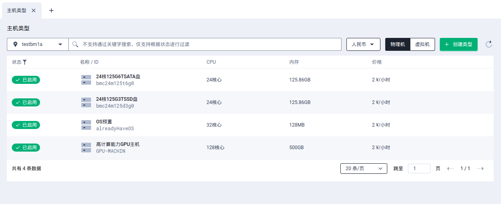

+ 点击`创建类型`，在弹出的对话框中填写`物理主机类型`的相应信息。

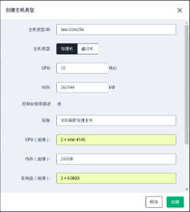

+ 其中`控制台信息描述`中的内容，对应的是租户在控制台上申请物理主机时选择类型后查看到的配置信息。
+ 对应图中填写的信息，租户在控制台上申请物理主机时查看到的主机类型配置信息如下：

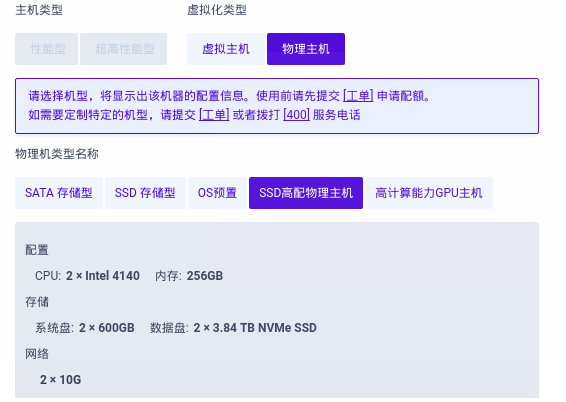

+ 点击`创建`，之后可查看到主机类型创建成功，当前为未启用状态。

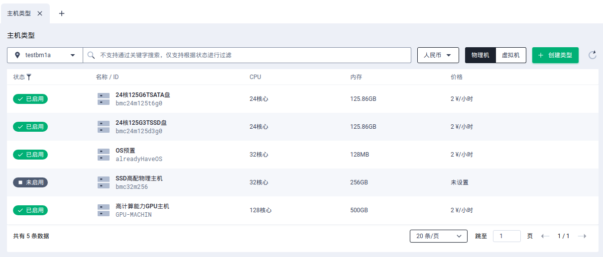

+ 可以看到新建的物理主机类型未设置价格，租户在控制台上申请物理主机，需要按照主机类型计费，因此需要为主机类型`设置价格`。
+ 在主机类型的记录上点击操作按钮，在展开的菜单中点击`设置价格`。

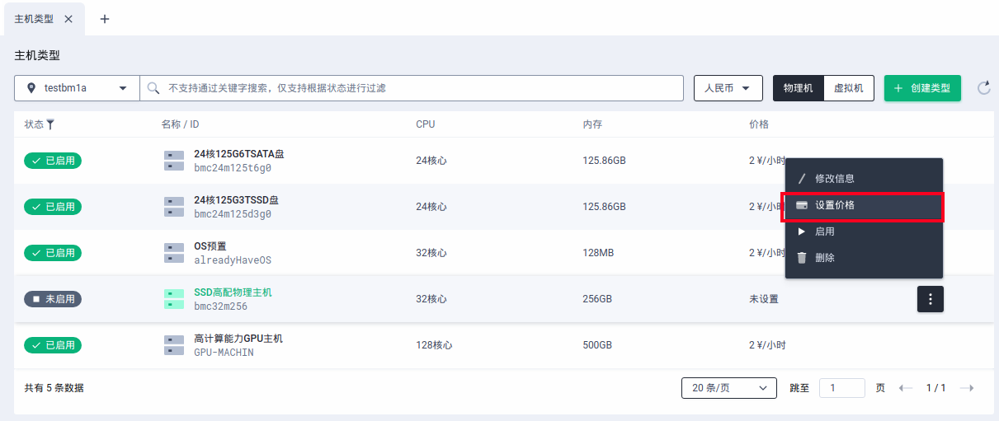

+ 在弹出的对话框输入每小时价格，点击`设置`。


+ 之后可以看到该物理主机类型的价格已经设置上了。

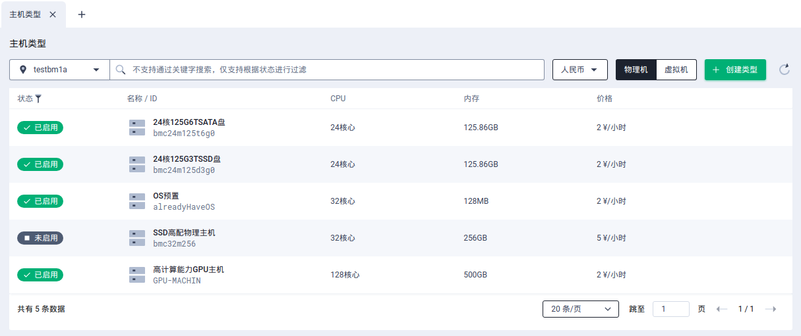

+ 此时可以将物理主机类型启用。


+ 启用后，即完成物理主机类型的新建。
+ 注：此时租户在控制台上可看到该物理主机类型，但是由于还没有实际可用的物理主机，所以此时租户创建物理主机会报`资源不足`。

##### 创建基础网络(`BM`)

+ `vlan_trunk`模式的物理主机不能加入到`VPC`网络，默认必须加入物理机模式的基础网络中，因此还需要创建物理机模式的基础网络供物理主机使用。
+ 物理主机使用的网络需参照`Installer`提供的文档在交换机上划分`vlan`时记录的`vlan id`和划分的网络地址。
+ 创建好的物理机模式的基础网络还需要关联到交换机，关联交换机时填写实际的`vlan id`。
+ 在基础网络详情页面，点击`绑定交换机`。


+ 在弹出的对话框中，点击`选择交换机`。

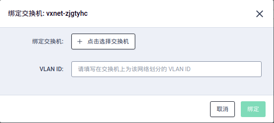
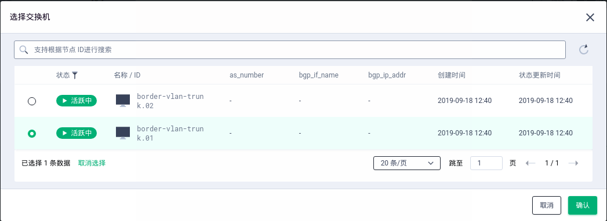

+ 选择交换机后点击`确认`，接着输入`VLAN ID`，点击`绑定`。


+ 这里绑定交换机时填写的`VLAN ID`需要是实际为该基础网络划分的`VLAN ID`。

##### 注册物理主机

+ 在物理主机页面，点击`创建主机`，在弹出的对话框中填写主机信息。

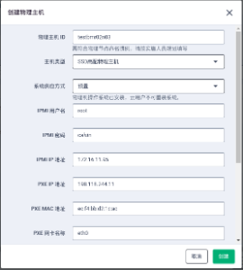

+ 系统供应方式分为两种：每次重装和预置。
+ 预置的含义为物理主机已经运行操作系统，分配给租户时无需重装系统和配置网络。
+ 新建的物理主机默认处于`已禁用`状态，还需为物理主机绑定交换机。


+ 点击`物理主机ID`，进入物理主机详情页，点击`绑定交换机`，在弹出的对话框中输入`接口名称`、`MAC` `地址`并选择要绑定的`交换机`。

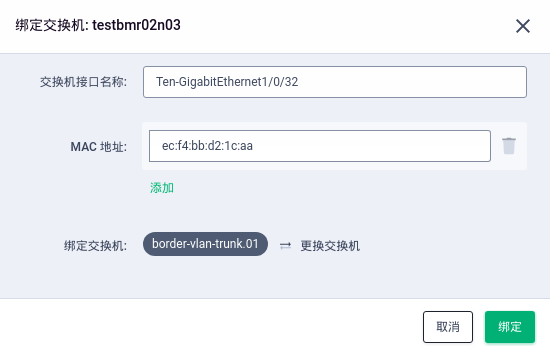

+ 点击`绑定`后出现交换机信息。


+ 之后，点击`标记状态`，选择`可用`状态，将物理主机启用。

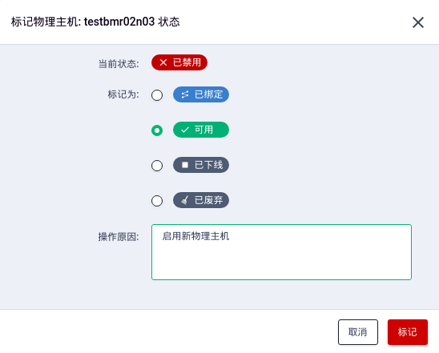

+ 经过上述步骤的操作后，该`BM`物理机已经部署完成，可以使用了。

#### CLI

##### 注册主机类型及价格

+ 从`webservice`节点进入`global db`中，执行如下操作:

```sql
-- global db
-- 不同的 instance_type 需要对应不同的 description 和 extra_info
-- 注意修改 ZONE_ID
INSERT INTO instance_type (instance_type_id, instance_type_name, description, vcpus_max, vcpus_current, memory_max, memory_current, zone_id, status, baremetal, extra_info) VALUES ('bmc16m64t40g0', '16核64G40TSATA盘', '{"name": "bm_sata_storage", "desc": "bm_sata_storage_desc", "zh": {"name": "SATA 存储型", "cpu": "1 x 2620 V4(16 核)", "memory": "64G", "os_disk": "1 * 100G SSD", "data_disk": "10 * 4T SATA", "cache_disk": "1 * 200 SSD", "network": "2 * 10G"}, "en": {"name": "SATA Storage", "cpu": "1 x 2620 V4(16 Core)", "memory": "64G", "os_disk": "1 * 100G SSD", "data_disk": "10 * 4T SATA", "cache_disk": "1 * 200 SSD", "network": "2 * 10G"}}', 16, 16, 65536, 65536, 'ZONE_ID', 'available', true, '{"resource_info": "bmc16m64t40g0"}');

-- biling_resource db
INSERT INTO price_list (charge_mode, currency, duration, price, price_key_id, resource_info) VALUES ('elastic', 'cny', 3600, 9000, 'pk-00000001', 'bmc16m64t40g0');
INSERT INTO price_list (charge_mode, currency, duration, price, price_key_id, resource_info) VALUES ('elastic', 'usd', 3600, 9000, 'pk-00000001', 'bmc16m64t40g0');
INSERT INTO price_list (charge_mode, currency, duration, price, price_key_id, resource_info) VALUES ('elastic', 'hkd', 3600, 9000, 'pk-00000001', 'bmc16m64t40g0');
```

+ 注意：实际的`主机配置 & 价格`请根据具体情况配置。
+ 在`fb`上重启`webservice0/1`上的`billing_resource`服务:

```bash
/pitrix/upgrade/exec_nodes.sh webservice "supervisorctl restart billing_resource"
```

+ 在`fb`上重启`bm0/1`上的所有服务：

```bash
/pitrix/upgrade/exec_nodes.sh bm "supervisorctl restart all"
```

##### 创建基础网络(`BM`)

+ 创建一个`BM`主机类型的基础网络:

```text
./create-vxnet -n 'BM base network' -t 2 -m 2 -i 10.73.20.0/24
```

```text
./describe-vxnets -v vxnet-r0ipqho -V 2 | grep 'vxnet_type\|mode\|vni\|router_id'
```

+ 查询数据库`zone`中查询出相应的`switch_id`：

```sql
SELECT * FROM vxnet_switch WHERE vxnet_id IN ('vxnet-ks', 'vxnet-r0ipqho');
```

+ 数据库`zone`中插入相应的数据(注意修改`switch_id`和`vlan_id`)：

```sql
-- vxnet_id: create-vxnet步骤得到的
-- switch_id: 保持不变
-- vlan_id: BM类型基础网络的实际vlan
INSERT INTO vxnet_switch(vxnet_id, switch_id, vlan_id) values('vxnet-r0ipqho', 'border-vlan-trunk.01', 3);
```

+ 修改`BM`基础网络的网关为实际的网关:

```sql
-- router_id: describe-vxnets步骤得到的
-- manager_ip: 实际的网关地址
UPDATE router_vxnet SET manager_ip = '' WHERE router_id = '';
```

+ 修改`BM`基础网络的`DHCP`范围:

```sql
-- router_id: describe-vxnets步骤得到的
UPDATE router_vxnet SET dyn_ip_start = '', dyn_ip_end = '' WHERE router_id = '';
```

##### 注册物理主机

+ `-b`: `BM Node`的主机名，建议和`IAAS`的主机名命名规则一致。
+ `-t`: 表示主机的类型`ID`, 与`5.1`中的`instance_type_id`保持一致且需要根据实际配置注册。
+ `--device_type`: 若是非`DELL`服务器，则填写`default`。
+ 此处每台`BM Node`都需要注册，会注册到`baremetal`表。

```text
./create-baremetal -b tr02n25 -d vlan-bm-02 --ipmi_ip_addr=172.18.10.25 --ipmi_username=root --ipmi_password=calvin --pxe_interface=eth0 --pxe_ip_addr=172.18.20.25 --pxe_mac_addr 24:6e:96:1b:5e:70 --device_type=dell -t bmc16m64t40g0 -s available
```

+ 若需要在创建`BM Instance`时允许跳过部署`OS`的步骤，用于支持纳管已安装`OS`的物理机，按照如下操作:

```bash
# zone db
UPDATE baremetal SET features = 1 where baremetal_id = 'tr02n25';
```

##### 将物理主机连接到交换机

+ `DB`: `zone`。
+ `table`: `baremetal_switch`。

+ `-b`: `BM Node`的主机名，与`5.3`的主机名保持一致。
+ `-s`: `switch_id`，保持不变。
+ `-p`: 代表`bond0`。
+ `-i`: 表示对应的交换机接口。
+ `-m`: 表示MAC地址。
+ 以下命令表示同一台`BM Node`的2个网口，每台`BM Node`需要注册`2`次。

```text
./attach-switch -b tr02n25 -s border-vlan-trunk.01 -p 0 -i Ten-GigabitEthernet1/0/18 -m a0:36:9f:b0:98:10
./attach-switch -b tr02n25 -s border-vlan-trunk.01 -p 0 -i Ten-GigabitEthernet2/0/18 -m a0:36:9f:b0:98:12
```

##### 将物理主机设置为可用

```text
./modify-baremetal-attributes -b tr02n25 -s available
```

##### 其他(特殊环境)

+ 若`pxe`启动不是使用`eth0`, 需要进入`zone db`中，执行如下操作:

```text
UPDATE baremetal SET pxe_interface = '{{INTERFACE}}' WHERE baremetal_id = '{{ID}}';
```

+ 若`os`不是安装在`sda`盘, 需要进入`zone db`中，执行如下操作:

```text
UPDATE baremetal SET boot_disk = '{{DISK_NAME}}' WHERE baremetal_id = '{{ID}}';
```

+ `vlan_trunk`模式下, 需要有一个`VM`类型的基础网络, 用于搜集监控信息。
+ `vlan_trunk`模式, 如果要允许`BM`主机运行在`VM`类型的基础网络, 需配置`server.yaml`, 然后重启`fg_server`:

```yaml
common:
    ignore_bm_vxnet_mode_check: 1
```

+ `vlan_trunk`模式, 如果`BM Node`只有`1`个数据网卡, 将`BM Node`万兆口对应的交换机端口，只做`trunk`，不要做`lacp`, 同时修改`DB`:

```sql
UPDATE baremetal SET bond_mode = 1 WHERE baremetal_id = '{{ID}}';
```

### 使用BM

####　分配BM实例

+ 对于系统供应方式为预置的物理主机，已安装操作系统，并且有可能已经运行了某个业务系统，这样的物理主机是不会被用户在控制台上申请到的。必须由管理员进行分配。
+ 在`BOSS`界面，点击`更多操作 ---> 分配用户`。

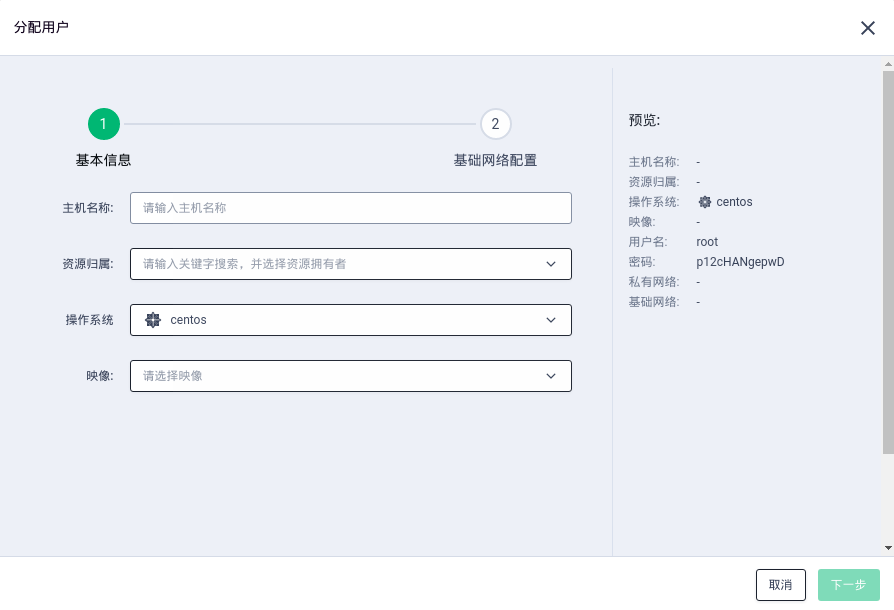

+ 输入`主机名称`，选择`资源归属用户`，操作系统以及映像后，点击`下一步`。

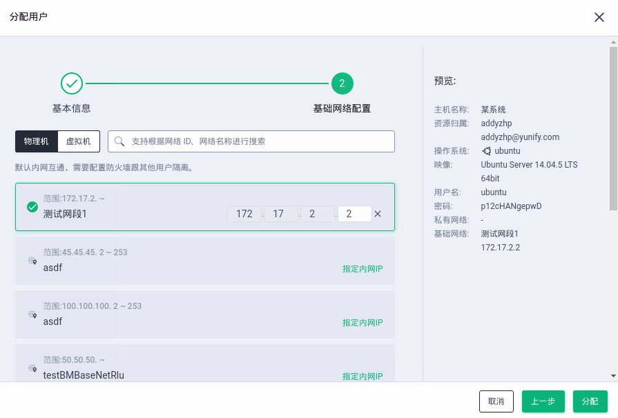

+ 为物理主机选择网络。
+ 由于预置系统的物理主机，已经具备`IP`地址，云平台不会对其进行操作系统层面的网络配置，因此对于这种物理主机，需要根据物理主机的实际网络在云平台创建基础网络，并指定物理主机的实际`IP`地址。
+ 之后点击`分配`，对应的用户在控制台上即可查看到该台物理主机。

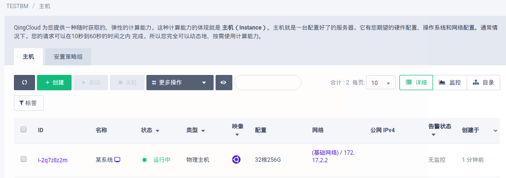

#### 支持Web VNC

+ 在`firstbox`节点添加`hosts`解析:

```bash
vim /pitrix/conf/variables/hosts
```

```text
# IPMI地址
172.18.10.10 tr02n25.mgmt.pitrix.yunify.com tr02n25
172.18.10.10 tr02n25.user.pitrix.yunify.com
```

```bash
/pitrix/upgrade/build_global_conf.sh
/pitrix/upgrade/update.sh -f all pitrix-hosts
/pitrix/upgrade/exec_nodes.sh -f proxy 'supervisorctl restart cb_server'
```

+ 若`proxy`节点的管理网络与`IPMI`网络是相通的，则无需进行以下的步骤。
+ 若`proxy`节点的管理网络与`IPMI`网络是不通的，则根据以下步骤，打通隧道。

+ 重设`BM Node`的`VNC Server`：

```text
./reset-vnc-server -i i-XXX
```

```text
# 假设：
# proxy0: 100.64.9.10
# proxy1: 100.64.9.20
# KS-BM-1: 10.16.92.10, bond0为管理网络, br1为PXE的网桥
# KS-BM-2: 10.16.92.20, bond0为管理网络, br1为PXE的网桥
# 未被使用的IPMI的网段的地址:
    198.18.240.7/22
    198.18.240.8/22

# proxy0(rc.local.tail)
# tunnel to ks-bm to enable bm vnc
ip link add vxlan0 mtu 1500 type vxlan dev eth0 remote 10.16.92.10 id 100
ifconfig vxlan0 198.18.240.7/22

# KS-BM-1(rc.local.tail)
# tunnel to proxy to enable bm vnc
ip link add vxlan0 mtu 1500 type vxlan dev bond0 remote 100.64.9.10 id 100
brctl addif br1 vxlan0
ip link set vxlan0 up
bridge fdb add ff:ff:ff:ff:ff:ff dst 100.64.9.10 dev vxlan0

# proxy1(rc.local.tail)
# tunnel to ks-bm to enable bm vnc
ip link add vxlan0 type vxlan dev eth0 remote 10.16.92.20 id 100
ifconfig vxlan0 198.18.240.8/22

# KS-BM-2(rc.local.tail)
# tunnel to proxy to enable bm vnc
ip link add vxlan0 mtu 1500 type vxlan dev bond0 remote 100.64.9.20 id 100
brctl addif br1 vxlan0
ip link set vxlan0 up
bridge fdb add ff:ff:ff:ff:ff:ff dst 100.64.9.20 dev vxlan0
```

#### 修改前端配置文件

+ 在`webservice0/1`上执行以下操作：

```bash
vim /pitrix/lib/pitrix-webconsole/mysite/local_config.yaml
```

```yaml
GLOBAL_CONFIG:
  # 指定哪些区需要显示物理主机按钮，若为非REGION环境，则把REGION_ID改为ZONE_ID，若为REGION环境，则改为region_id
  valid_run_instances_with_bm_zones: ['REGION_ID']

ZONE_CONFIG:
  default:
    # 是否允许 BM 运行在 vlan/vxlan 模式下
    support_run_bare_metal_in_vxlan_mode: false
    # 是否允许 BM 在 vlan/vxlan 模式下加入 BM VBC
    support_bm_join_bm_vbc_in_vxlan_mode: false
    # 是否允许 BM 运行在 vlan_trunk 模式下
    support_run_bare_metal_in_vlan_trunk_mode: true
    # 是否允许 BM 在 vlan_trunk 模式下加入 BM VBC
    support_bm_join_vm_vbc_in_vlan_trunk_mode: true
    # 是否从主机类型描述字段读取配置, 若为20190318之前的版本，需要改为 false
    support_bm_instance_type_desc: true
    # 是否支持VPC Border的特性
    support_vpc_border_features: false
    # 是否支持运行物理主机
    support_run_instances_with_bare_metal: true
    # 需要与注册的 instance_type 的 description 的 name 保持一致
    support_instance_types_for_bare_metal:
      - bm_sata_storage
    support_bm_vbc: true
```

+ 重载`Apache`服务：

```text
service apache2 reload
```

#### 创建BM主机

+ 方式一：到`Console`控制台创建`BM Instance`。
+ 方式二：使用`CLI`创建`BM Instance`，以下为`CLI`的主要步骤。

+ 增加用户配额：

```text
./update-quotas --bm_instance 10 -u USER_ID
```

+ 创建`BM Instance`(支持`BM`的镜像有`CentOS/Ubuntu/Win2012/Win2016/SUSE`)：

```text
cd /pitrix/cli/
./run-instances -i trustysrvx64i -t bmc4m16 -m passwd -p Zhu88jie -n vxnet-r0ipqho --hypervisor bm --hyper_node_id=tr02n25
```

+ `IBM`服务器不支持`web terminal`, 并且需要手动配置`raid`, 推荐配两个`vol`: `OS`和`data`，`OS`需要小于`2T`，系统会安装到第一个容量大于`20G`的`vol`。

#### 清理垃圾

+ 清理部署时残留的`dhcpd`进程:

```text
# 以下为示例，ID为: i-t6tf0x01

systemctl stop i-t6tf0x01_dhcpd.service
rm -f /pitrix/pxe/i-t6tf0x01*
rm -f /lib/systemd/system/i-t6tf0x01_dhcpd.service
systemctl daemon-reload
```

#### 监控

+ 对物理主机启用监控，请参考文档[配置物理主机监控](https://docs.qingcloud.com/product/computing/bm_instance#%E7%89%A9%E7%90%86%E4%B8%BB%E6%9C%BA%E7%9B%91%E6%8E%A7)。

***
